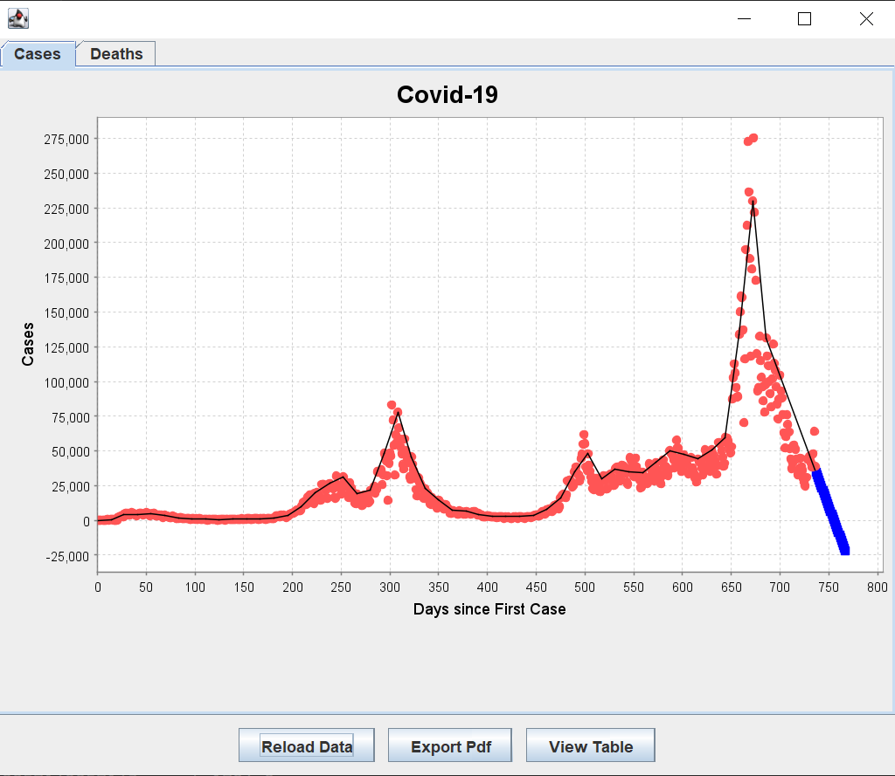
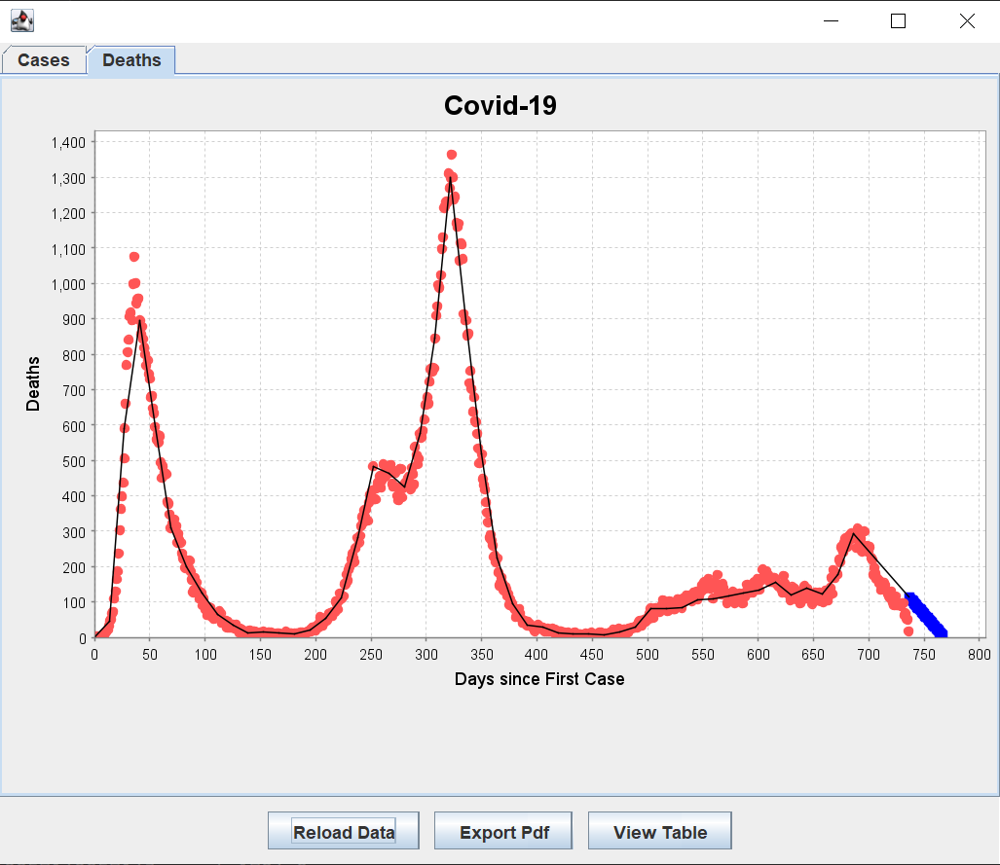
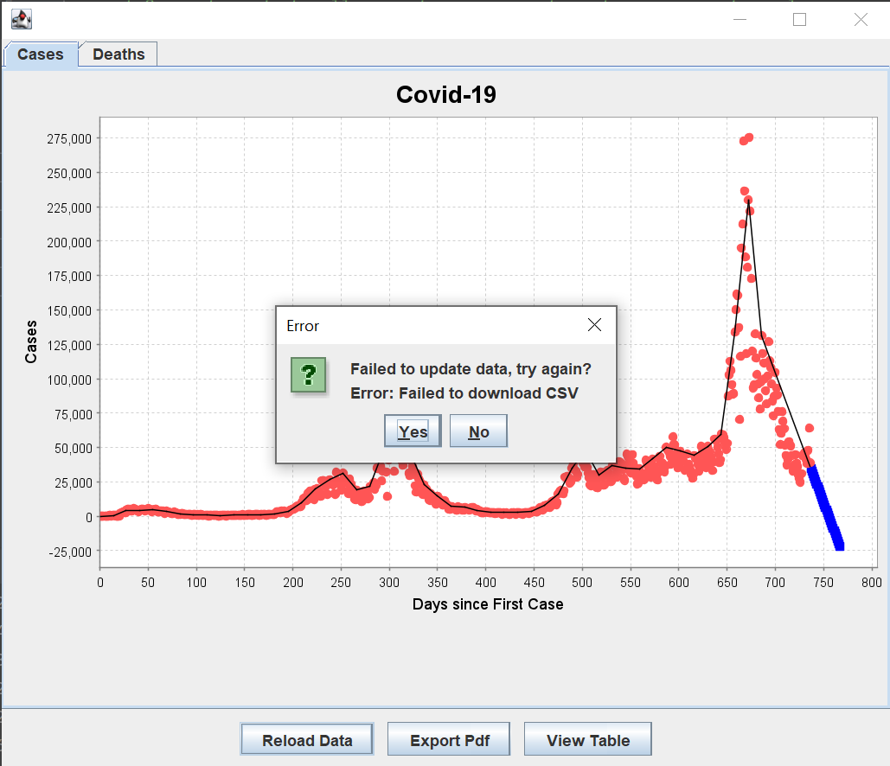
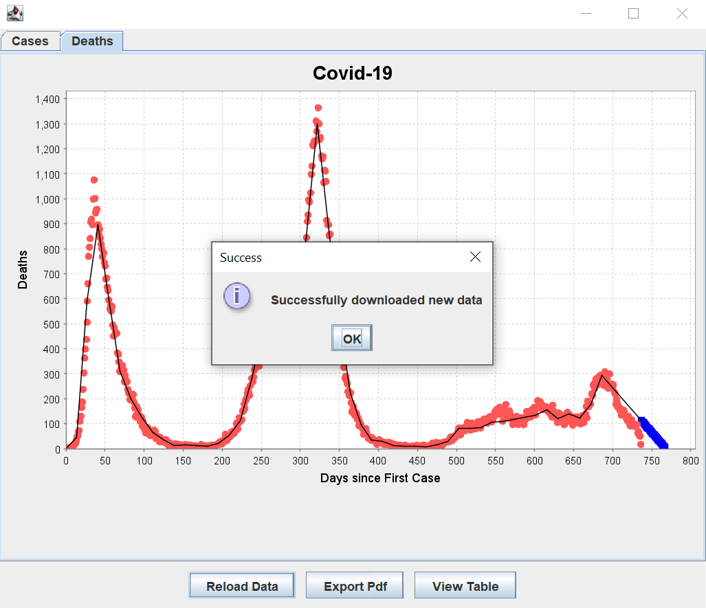
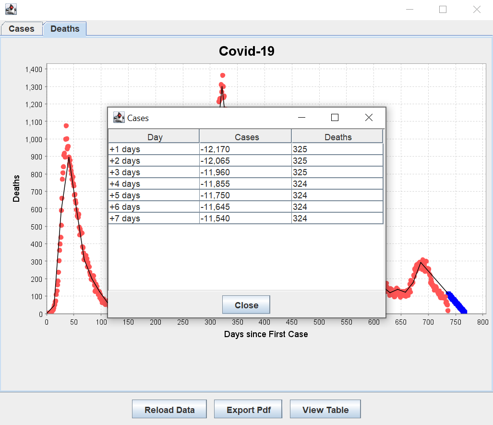
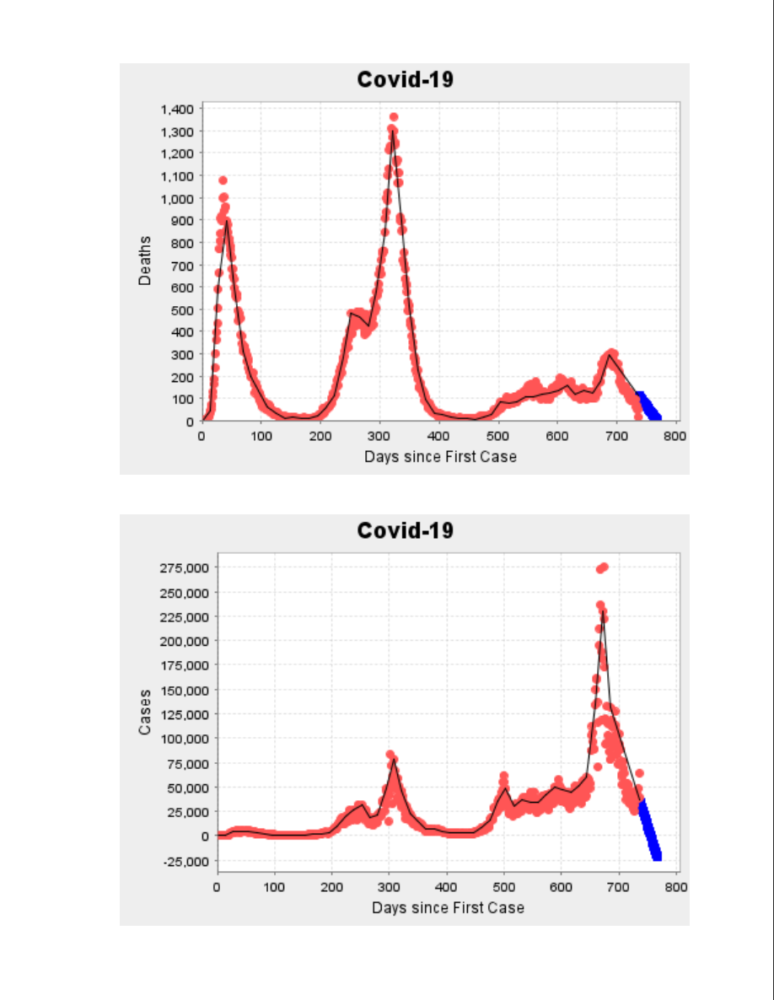
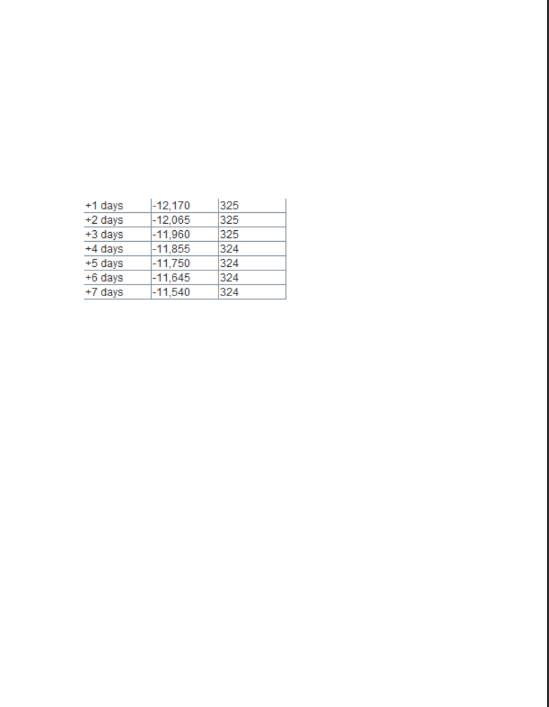

# Product Demonstration Report

Our product's goal is to evaluate current COVID-19 data, which is available on the UK government's website; this is done via graphing data points & producing a model of the data to predict beyond the current data into the future. Our final product displays a graph of COVID-19 cases and a graph of Deaths caused by COVID-19. The regression line is modelled using piecewise. In addition to the graphs, we implemented features such as generating PDF of the obtained data, updating graph to the latest data and viewing predicted data in a table.

## Downloading and parsing CSV data
On startup the application will look for pre-cached CSV data, if it is found then the application will load it; if it is not found then the application will attempt to download the data from the UK government's website. In-case of errors in the downloading, reading or parsing of the data, relevant error dialogs are displayed to the user which will ask if the user wishes to retry. Data that is downloaded is parsed into data types that are useful for the rest of the program, so dates from the CSV data are parsed into dates, etc. 

## Linear Regression Model
The linear regression model takes two identically sized arrays of x and y values, it then produces a model, which is interactable using the Model interface, which allows predictions to be made via the interface. The linear regression model is created using derived formula from attempting to optimize the R-squared value of the model line. The description for how a line is selected is documented here: https://cseegit.essex.ac.uk/21-22-ce201-col/CE201_liang-3/-/blob/24907f07c9d4f4c42d7b4963296d8edc830d9894/research/linear_regression/linear_regression.md

## Piecewise Linear Regression Model
The piecewise linear regression produces a model by using multiple linear regression line, it joins every linear regression line at a point called "breakpoint". This allows for more fitting graph than linear graph model. The Piecewise linear regression model is created using a formula "y=α+β1​x+β2​(x−k2​)D". The description on how the model is implemented is documented here: https://cseegit.essex.ac.uk/21-22-ce201-col/CE201_liang-3/-/blob/Jamie/research/linear_regression/piecewise.md

## User interface
The parsed CSV data and model are passed to the graph component. The graph component is able to display a scatter plot of the data points from the COVID-19 data, while drawing a line to match the generated prediction model. The graph is capable of being zoomed and of being updated with new data points. The user can use the tabs on the user interface to select if they would like to display graphs for cases data or for deaths data, both of which have separate models for prediction that are displayed alongside the relevant data. The buttons below the graph lets the user to redownload updated data incase it has not been updated for a while, or if the application has been running for a long time, export the obtained data from the graph into a PDF and displays the obtained prediction into a table format.

## Demonstration from the user's perspective

When starting the application, the application will attempt to display the following graph, which will show the CSV data either obtained from the file cache or by downloading from the government's website via their relevant data API.

If the user clicks the deaths tab on the top left of the application, it will change to displaying the data and model related to recorded COVID-19 deaths.

On application launch, or if the user clicks the reload button, the application will try to download new data from the government website; if this fails, it will display an error message informing the user, and asking them how they would like to proceed. If the user clicks yes, then the application will try again to download the data again; if the user clicks no or closes the error dialoge, the application will stop trying until the user clicks the reload button or restarts the application again.

If data is successfully download, after user input informing the application to attempt to download the new data, then a dialog is displayed to the user confirming the success of the operation. This is only displayed after the user either clicks the reload data button, or after a failed download the user clicks yes on the retry dialog; in the case of the application starting from a fresh launch, the dialog is not displayed as the feedback provided to the user is in the form of the application opening successfully, and a dialog box is not needed.

If the user clicks view table on bottom right of the application, it will display the prediction obtained using piecewise linear regression in a table format. The prediction is displayed up till day 7.

If the user clicks export pdf button on bottom left, the application will tranport the graph of COVID-19 cases, COVID-19 death and prediction into a PDF file. 

