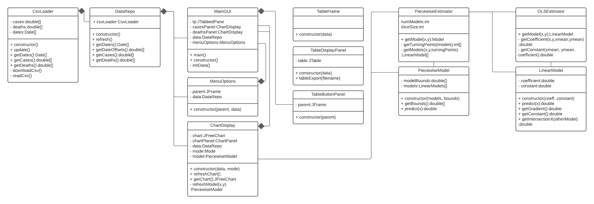

# Team Implementation Report
*This section should describe the technical details of your implementation.  The subheadings and italicised text below may be used to guide you.*

## Technical Diagrams

## Technical Description

### Data IO

#### CSV Loader
The CSV loader handles downloading, caching and parsing of the CSV available from the gov.uk coronavirus API. Data CSVs
from the government API is saved on disk in a cache to prevent rapid API requests and to speed up application startup.
If the cache is empty then the CSV loader will download a new CSV and ensure folders are created for the cache to be
stored in. CSV data is parsed after either being downloaded or read from the local cache to produce arrays of doubles
representing the numbers of cases and deaths downloaded from the web API, as well as an array of dates for each value.
The CSV loader provides the ability to redownload data incase of the cached data being out of date.

#### Data Repo
The data repo is a wrapper class around the CSV loader that processes the dates parsed from the web API into day offset
values, which can be used with the graph and regression calculations. The data repo is what the rest of the application
interacts with, instead of the CSV loader directly.

### Regression

### GUI

*This section should describe the software implementation in prose form.  Focus on how the code was designed and built.* 
*It should make a clear description that could be used by any future developers to maintain and extend your code, if necessary.*
*Describe important functions / classes / class hierarchies.*
*In this section, you should also wish to highlight any technical achievements your team is particularly proud of, including relevant code snippets.*

## Algorithms and Data Structures

#### Algorithm: Ordinary Least Squares
Ordinary least squares is used to calculate an optimum regression line to fit the parametrized data by minimising the
squared residuals of the resultant regression line. A straight line function has two components; a gradient and a
constant intercept. Calculating the gradient is performed as follows

$`\hat\beta=\displaystyle\frac{\sum(x_i-\bar x)(y_i-\bar y)}{\sum(x_i-\bar x)^2}`$

Calculating the intercept is then calculated using:

$`\hat\alpha=\bar y-\hat\beta \bar x`$

The estimator then returns a Linear Model object with these parameters.

Runtime efficiency of the algorithm can be calculated by inspecting the individual operations performed during the
algorithm. The first operations performed are calculations of the mean for both the x and the y values; each taking
O(n) time. After both means have been calculated, the program calculates the gradient coefficient, which
involves iterating over every element in each array at the same time, this therefore is also an O(n) operation. Finally
the algorithm calculates the constant intercept value for the line, which is an O(1) operation. This means that
ignoring constant factors, the overall runtime efficiency is O(n).

#### Data Structure: Array for dates, cases and deaths data
The number of cases and deaths are stored in a plain arrays of doubles, while the parsed dates are stored in an array of
Date objects. The data when being loaded from the CSV file is initially stored into an ArrayList, however this is copied
into an array once the size is known. The reason for the choice of an array is an attempt to make use of the data
require as little knowledge as possible for all team members, some of which are less confident with Java; this way no
knowledge of lists, ArrayLists or a custom container object is required.

Populating each individual element of the ArrayLists has a time complexity of
O(1); except for situations where the ArrayList is full and must be resized, in which case the entire contents of the
ArrayList at that point in time is copied into a new container with a time complexity of O(n). The average runtime
complexity of inserting an element to the ArrayList remains at O(1), as the occasional copying of elements has an
average effect of a constant factor on each insertion. Copying from the ArrayList into the arrays used throughout the rest of the program is an O(n) operation

## Imported Libraries 
- JFreeChart - Used for scatter plot generation, which is used in both the GUI application, as well as exported and
  saved in PDF form.
- PDFbox - Used to generate PDF files containing text and images for the export feature.
- JUnit - Used for some unit tests.

## Known Issues
*List any known issues (bugs) in your software, and describe workarounds if they exist.*
