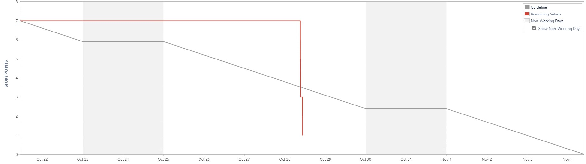
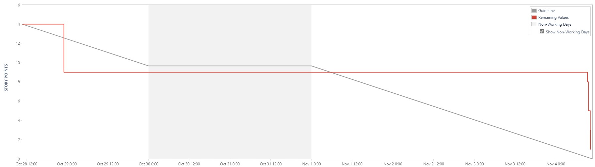
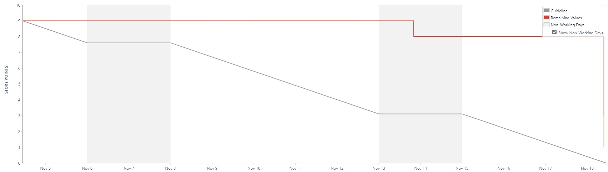
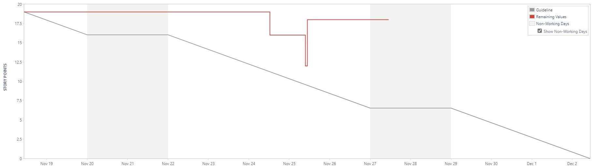
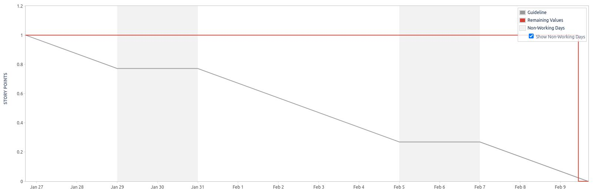
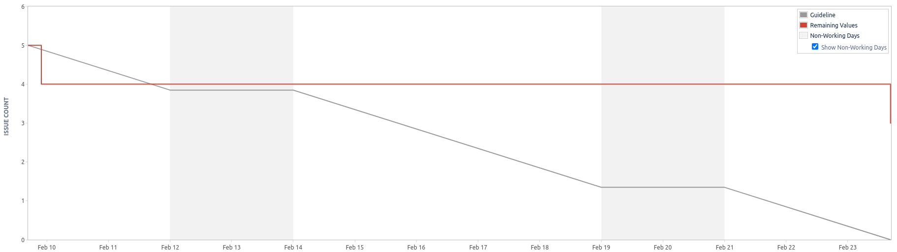
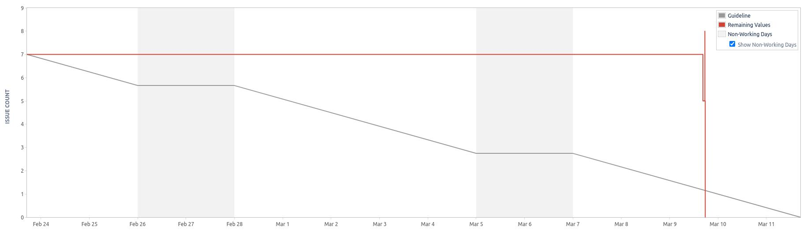
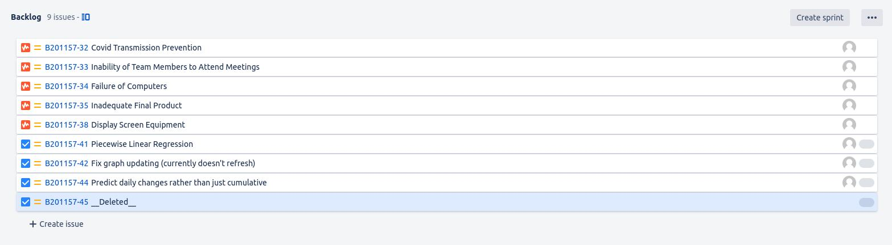

# Project Management Log

## Project management discussion

As the project nears its finish, overall the team consistently attended the end of sprint meetings and effectively discussed what features the program needed and any individual issues. The meetings were also used as an oppurtunity for members to discuss any issues they are having with their assigned tasks. As the project went on, the work that needed to be completed decreased substantially and so sprints became fortnightly as to give more time for tasks to be completed to a higher level of quality.

The team continued to use whatsapp outside of scrum meetings to communicate and bring up any potential new features and assist with any issues that arise with the development of the project. This method of communication became more important when sprints shifted from weekly to every 2 weeks as with that the team was only required to come in half the time as before.

## Sprint Burndown Charts

## Burndown-Charts Discussion

Due to the MVP having the majority of the required features, the later sprints have been longer in order to prioritise quality over speed. As shown in the burn-down chart, sprint 6 had no tasks completed as the individual tasks were larger than the ones given before so at the end of the sprint we found that more time was needed to complete them.

## Product Backlog

