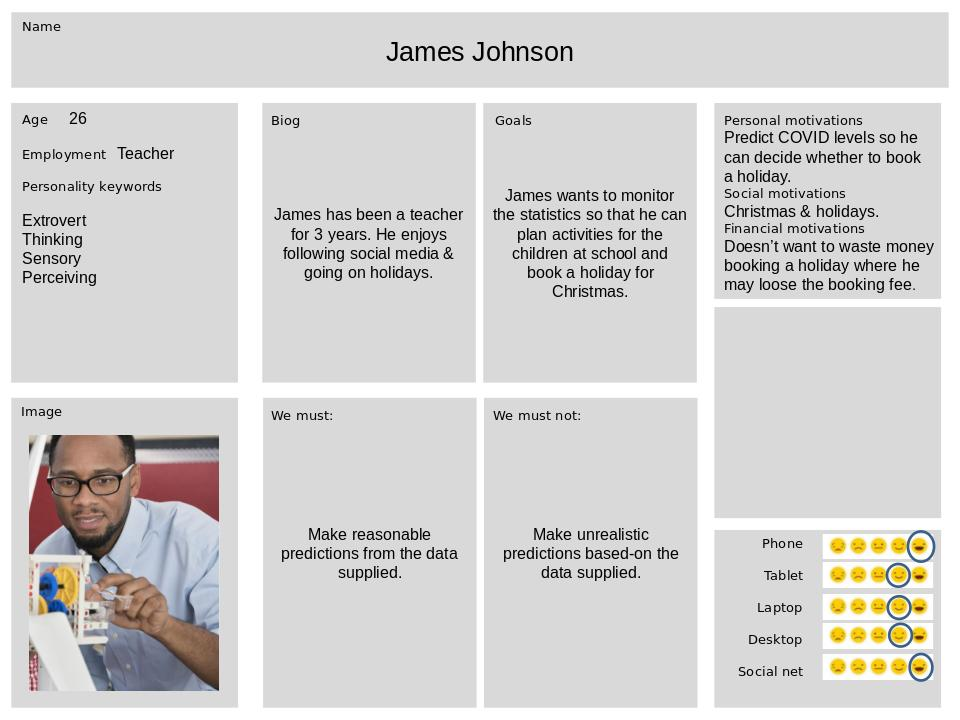
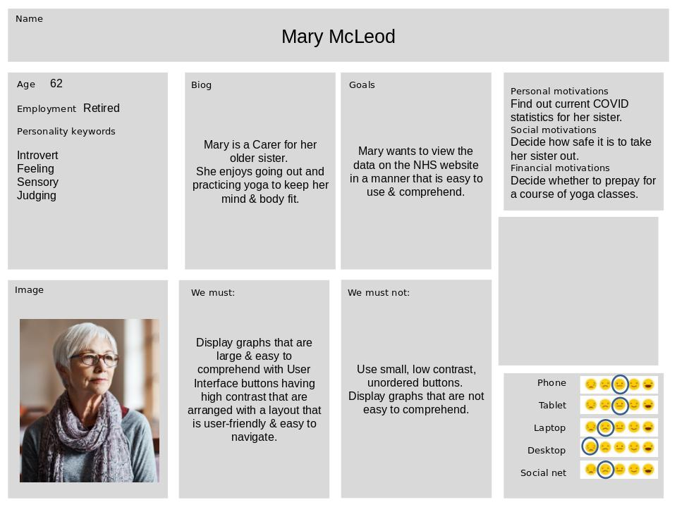
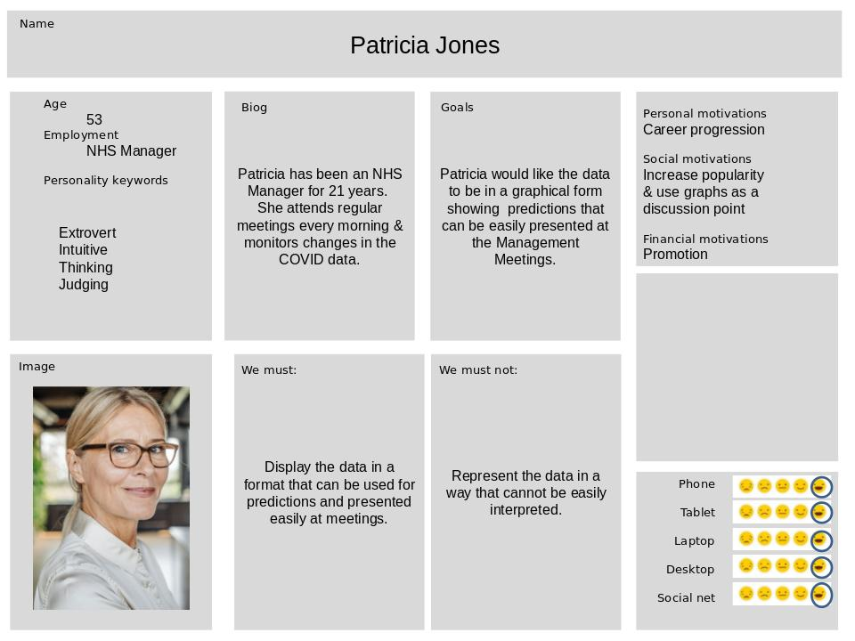

# Requirements

### User Stories
* https://cseejira.essex.ac.uk/browse/B201157-10
* User personas made by Wigton, Durga and was completed  during a previous sprint
* User story was made using the persona created
* As a Teacher I want to be able to monitor covid-19 statistics so I can plan activities for the children in my classes and book a holiday for christmas

* As a retiree in the vulnerable category I want to be able to check current covid-19 statistics in order to decide on safe times to take my sister out

* As a NHS manager i want to be able to view covid-19 predictions To present in management and strategy meetings

### Functional Requirements
The product should be able to do the following:
* Display the latest covid-19 deaths and cases in a graphical format
* Be able to predict the deaths and cases upto a week in the future 
* Be able to export the current and predicted data to a PDF file
* Be able to display the contents of the graph to command as values 
* Be able to reload/refresh the graph to update the data to ensure all data is up to date 

### Non-Functional Requirements
The product will have the following requirements
* Display the data in a human readable format, both graphical and numerical
* Accurately predict future cases and deaths for up to a week in the future
* Be able to keep up to date (to the day) with latest covid-19 information
* Be able to export the data to PDF in a way that the user can understand and tell the difference between predicted and current death/cases
### Constraints
The product will have the following constraints:
* Prediction will only go as far as one week in the future 
* Prediction accuracy will only be as accurate as quality and quantity of data provided
* Time to predict will increase with data provided (program will get slower as more data is provided)
* Prediction done off of case and death data only so accuracy will vary

## Risk Log

1. Covid Transmission Prevention:
Preventative actions have been put into place to deal with the current Delta variant of Covid-19 which can lead to hospitalization and death. Some patients may take longer to recover and be diagnosed with long-Covid and the University will make allowances for them to recover. Student sickness due to Covid may affect the Team Project by reducing the number of Team members able to contribute to the Task. Contingency measures include having deputy members in place to help complete the sub-tasks on time and the use of good communication by email or WhatsApp to keep other Team members informed if a Team member is unwell.
Many students, lecturers, staff and visitors may be asymptomatic so the health center has contacted patients to take-up the offer of vaccination as recommended in the government guidelines in to prevent spread of the disease to the elderly and extremely vulnerable patients. Posters and signage have been placed around the University of Essex to express the importance of wearing a face covering especially in an enclosed area (unless a medical exemption applies). Social distancing  and regular handwashing is recommended while on campus and staff and students are encouraged to take an in initial test after 3 days and then bi-weekly tests to prevent the spread of the disease. Colchester campus has a Test and Trace area set up to allow access to PCR testing and there are areas set up to enable students to obtain the tests on site. NHS Test and Trace is available for staff and students who are symptomatic. The University should be notified immediately so provisions can be made for isolation.  
The wiping over of keyboards and work areas with sanitizing wipes and the use of hand sanitizer before and after using laboratory areas is recommended by the Department of Computer Science and Electronic Engineering. The unnecessary sharing equipment such as pens should be kept to a minimum. Lectures are limited to online teaching via Zoom to minimize risk of exposure. Hand sanitizer pumps are located at high touch areas around the University such as photocopiers and drinking fountains. One-way systems have been implemented around the University to encourage social distancing. Contactless payment systems are recommended in the food areas to reduce transmission of the virus. Enhanced regular cleaning and sanitizing of high touch points has been implemented by the university along with a 72-hours period of leaving the area quarantined before cleaning staff are allowed to access the premises. Return to Work Risk Assessments and training should also be undertaken by the Departments to minimize the risk of transmission. Further up to date guidance on Covid guidelines can be obtained from the Government website and the University of Essex website (links below):
https://www.gov.uk/coronavirus?gclid=CjwKCAiA4veMBhAMEiwAU4XRr8NnFUoM_MjBN6bNkOqxyUz2Z2D1JZ5DXckYmtDs-8e1Ue2zdIKQHhoCiUIQAvD_BwE
https://www.essex.ac.uk/covid-19
https://www.essex.ac.uk/student/covid-19/support

Possible Major

2. Inability of Team Members to attend meetings:
Currently staff and students may travel abroad by plane in the holidays and be able to return due to travel restrictions or lockdown. Mandatory isolation due to Covid may also inhibit staff and students from reaching campus.
The University of Essex is accessible by foot, bike, car, train, bus, coach, taxi and e-scooter.
Due to traffic, accident, lack of funds, closure of the Orwell Bridge or adverse weather conditions, students and staff may be unable to get to scheduled meetings.
For the Team Project, contingencies are put into place to ensure that a Deputy can take-over any sub tasks to ensure that deadlines are met on time. If notice of non-attendance is given, provision can be made for the Team member to access the meeting via Zoom. 

Unlikely minor

3. Failure of Computers:
The risk of theft of computer hardware is minimized by using camera surveillance in the laboratories of the Department of Computer Science and Electronic Engineering. Electrical equipment is a fire risk if the equipment is old, un-serviced or has bad wiring. The computers in the University are regularly maintained to prevent this for occurring. Heat, humidity and water can also affect computer hardware and adequate cooling and ventilation is necessary. The laboratories are regularly maintained by technicians who check the computers and servers. Cyber security is mitigated by the use techniques such as firewalls, antivirus software and encryption. Denial of Service attacks, SQL injection attacks and Patent trolls are also a risk to the security of the computers at the university. The General Data Protection Regulations 2018 (GDPR) are adhered to, to ensure the confidentiality of personal details about students, staff and contractors. Software may also fail due to bugs in the software, network security attacks, lack of upgrade to the software or updates that are incompatible. The University has servers that are maintained and updated by technicians who will assess these risks. Each of the Team members has access to a personal laptop or Personal Computer to complete their sub-tasks remotely if necessary.

Possible Moderate

4. Inadequate Final Product:
Inadequate understanding of the requirements can impact the design process. Adapting an agile methodology helps to understand Client needs at each stage of the task by receiving continuous feedback from the Client. Good design that lacks complexity, planning and peer reviews help to catch issues early on in the process. The design should be looked at using a fresh approach to the task and not taken from legacy designs that may have pre-existing issues. Independent testing is necessary to ensure that any serious defects are not missed. Any ineffective team members must also be managed effectively to ensure deadlines are met. 

Unlikely Moderate

5. Display Screen Equipment
The User should perform regular Workstation Risk Assessments to identify possible issues that can be passed on to the laboratory technicians. The User should also perform workstation self-assessments at home as necessary. Potential health risks include visual fatigue, postural fatigue, operational stress and work-related upper limb disorders (WRULD). The Health and Safety Display Screen Equipment Regulations 1992 should be adhered to so far as is reasonably practicable. The work surface should be at a comfortable height with sufficient thigh and knee clearance, free from glare and with sufficient storage for equipment. The seat should be an swivel chair with a 5-star base and adjustable height and tilt. When typing, the user’s wrists should be straight, their feet flat on the floor, their lower back supported and their shoulders relaxed. The keyboard should be easily readable and separate from the monitor and have the ability to be tilted if needed. The monitor should be directly in front of the user at the correct height, distance and angle. The screen should be clean, glare-free and have the ability to be tilted. The characters on the screen should be legible and the brightness and contrast should be adjusted if necessary. The keyboard and mouse should also be within reach. The environment should have sufficient light and have reasonable temperature, be free from draughts and excessive background noise. Adequate breaks and stretching exercises should be encouraged. All display equipment users should have regular eye tests. All work areas should be wiped with sanitizer before and after use to prevent the transmission of diseases. 

Unlikely minor
